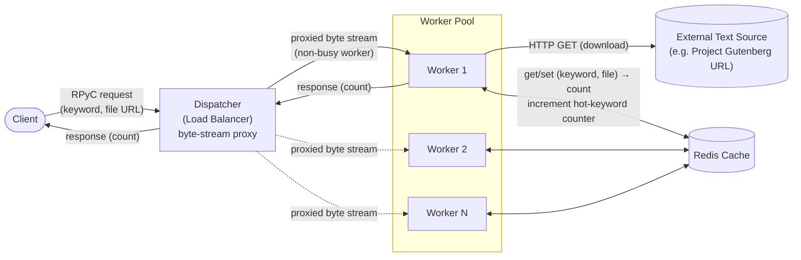
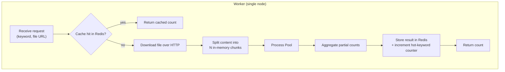
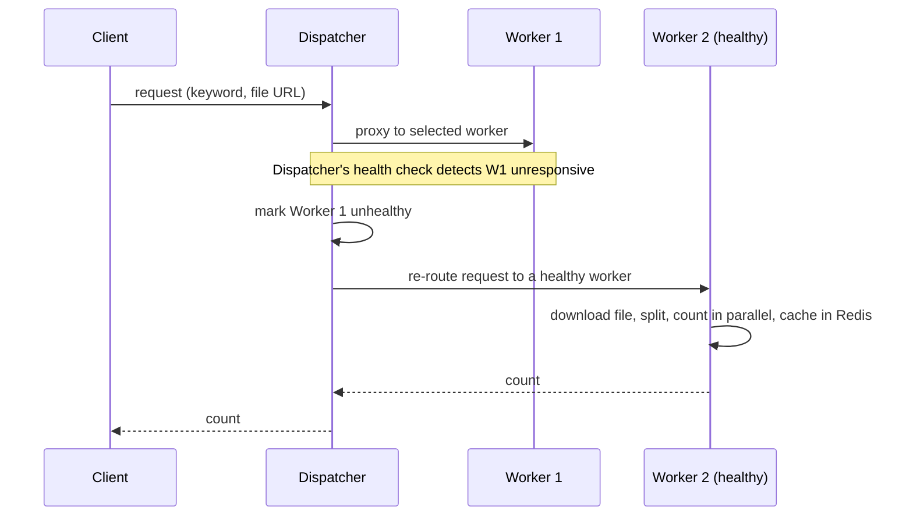

# Phase 1: Architectural Model — Word Count Service

## Requirements & Stakeholders

### Functional Requirements

- **FR1**: The system shall allow a client to send a request containing a keyword and a reference (URL) to a text file, and shall return the number of occurrences of that keyword in the file.
- **FR2**: The system shall cache the result of each `(keyword, file)` request and shall track keyword request frequency, so that repeated requests are served from cache and the most frequently requested ("hot") keywords can be queried.

### Non-Functional Requirements

- **NFR1 — Performance**: The system shall respond to keyword-count requests with low execution latency (measured in milliseconds), by serving cache hits directly and, on a cache miss, by parallelizing the counting work in memory across multiple processes within the worker node handling the request, rather than counting the whole file sequentially.
- **NFR2 — Fault Tolerance / Reliability**: The system shall remain available to the client despite the failure of an individual worker node — if a worker becomes unresponsive, the dispatcher shall detect this via health checks and re-route the request to another healthy worker, which processes it from scratch.

### Stakeholders

- **End user / client application**: Issues keyword-count requests; primarily cares about NFR1 (fast, accurate responses).
- **System operator / maintainer**: Runs and monitors the dispatcher, worker cluster, and Redis cache; primarily cares about NFR2 (the system keeps working when a node fails) and overall resource usage.

## Architecture Diagram (Client → Dispatcher → Worker)

## Component Description

- **Dispatcher (Load Balancer)**: Accepts the client's connection at the raw socket / byte-stream level — it does **not** speak RPyC itself. It selects a non-busy worker using a dynamic load-balancing algorithm (e.g., Least Connections) and relays the byte stream between client and worker. It tracks each worker's active-request count (incrementing on assignment, decrementing when the proxied response completes) to know which workers are busy, and periodically health-checks workers to detect failures.
- **Worker (Server replica)**: Exposes an RPyC service. On receiving a request, it downloads the referenced text file over HTTP from the given URL, splits the downloaded content into chunks in memory, counts keyword occurrences across chunks in parallel using a process pool, aggregates the partial counts, updates Redis, and returns the final count. A single file/request is handled entirely by one worker — files are never split across workers.
- **External Text Source**: A public host (e.g., Project Gutenberg) serving the plain-text file at the URL the client referenced; the worker fetches it directly over HTTP.
- **Redis Cache**: Shared in-memory store, keyed by `(keyword, file reference)` so a cache hit is valid regardless of which worker originally computed it. Also holds per-keyword request-frequency counters for hot-keyword tracking.

## Connectors

- **Client ↔ Dispatcher**: RPyC protocol carried over a raw socket; the dispatcher does not parse or terminate RPyC, it only operates at the byte-stream level.
- **Dispatcher ↔ Worker**: Raw socket relay of that same byte stream — the worker's RPyC service is the actual endpoint that terminates the RPyC session; the dispatcher just proxies bytes to/from whichever worker it selected.
- **Worker ↔ External Text Source**: HTTP GET over the network to download the file content.
- **Worker ↔ Redis**: Synchronous key-value get/set over TCP.
- **Worker internal chunk counting**: In-process parallelism via a process pool — local to the worker, not a network connector.

## Worker — Internal Detail (Download + In-Memory Parallel Count)

**Workflow:**

1. **Receive**: The worker's RPyC service receives the request (keyword, file URL) proxied through the dispatcher.
2. **Cache check**: The worker looks up `(keyword, file)` in Redis. On a hit, it returns the cached count immediately.
3. **Download**: On a miss, the worker downloads the file content over HTTP from the given URL.
4. **Split**: The worker splits the downloaded content into N in-memory chunks (avoiding splitting a word across a chunk boundary), entirely within its own memory — no other worker is involved.
5. **Count in parallel**: The worker counts keyword occurrences per chunk using a process pool, to get real parallelism for the CPU-bound counting work.
6. **Aggregate**: The worker sums the partial counts into the final result.
7. **Cache & respond**: The worker stores the result in Redis, increments the keyword's hot-counter, and returns the count, which flows back through the dispatcher to the client.

**Failure handling (worker-level, detected by the dispatcher):**

This dispatcher/worker structure is the basis extended in Phase 3 (replicating workers and choosing between two dynamic load-balancing algorithms) and Phase 4 (adding periodic health checks and re-routing on failure, as shown above).
