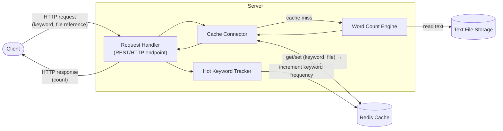
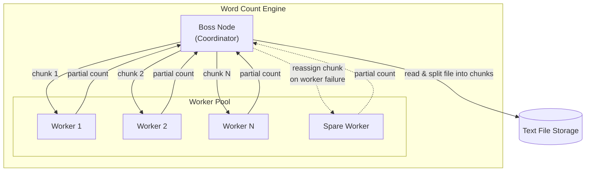
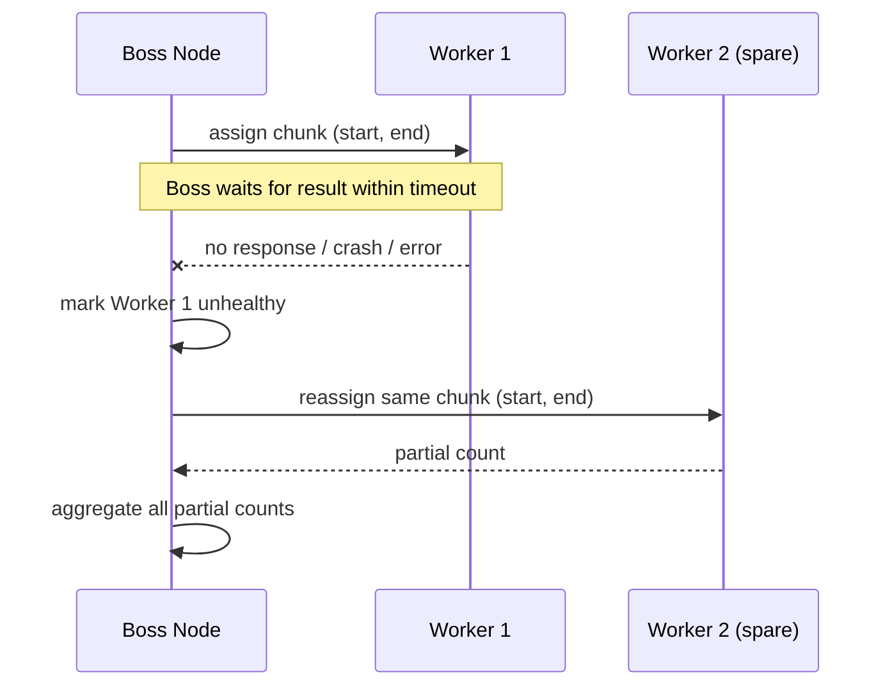

# Phase 1: Architectural Model — Word Count Service

## Requirements & Stakeholders

### Functional Requirements

- **FR1**: The system shall allow a client to send a request containing a keyword and a reference to a text file, and shall return the number of occurrences of that keyword in the file.
- **FR2**: The system shall cache the result of each `(keyword, file)` request and shall track keyword request frequency, so that repeated requests are served from cache and the most frequently requested ("hot") keywords can be queried.

### Non-Functional Requirements

- **NFR1 — Performance**: The system shall respond to keyword-count requests with low execution latency (measured in milliseconds), by serving cache hits directly and by parallelizing cache-miss computation across worker nodes rather than counting the whole file sequentially.
- **NFR2 — Fault Tolerance / Reliability**: The system shall remain available to the client despite the failure of an individual worker node — if a worker fails or times out while counting its chunk, the Boss node shall reassign that chunk to another worker so the overall request still completes correctly.

### Stakeholders

- **End user / client application**: Issues keyword-count requests; primarily cares about NFR1 (fast, accurate responses).
- **System operator / maintainer**: Runs and monitors the server cluster and Redis cache; primarily cares about NFR2 (the system keeps working when a node fails) and overall resource usage.

## Architecture Diagram (Server-Side View)

## Component Description

- **Request Handler**: Receives the client's HTTP request containing a keyword and a text file reference, and returns the count in the HTTP response.
- **Cache Connector**: Looks up the `(keyword, file)` pair in Redis before any computation. On a cache hit, it returns the stored count immediately, reducing latency. On a miss, it forwards the request to the Word Count Engine and stores the newly computed result back into Redis.
- **Word Count Engine**: Reads the referenced text file from storage and counts the occurrences of the keyword.
- **Hot Keyword Tracker**: Increments a per-keyword frequency counter in Redis on every request, so the most frequently requested keywords can be queried later.
- **Redis Cache**: In-memory store holding two kinds of data: (1) cached `(keyword, file) → count` results, (2) keyword request frequency counters.
- **Text File Storage**: Holds the text documents that clients reference by name; read-only from the server's perspective.

## Connectors

- **Client ↔ Request Handler**: Synchronous request/response over HTTP.
- **Cache Connector ↔ Redis**: Synchronous key-value get/set over TCP.
- **Word Count Engine ↔ Text File Storage**: Local/networked file read.

## Word Count Engine — Internal Detail (Master-Worker Pattern)

On a cache miss, the Word Count Engine does not count the whole file itself. It splits the work across a pool of worker nodes and aggregates their partial results.

**Failure handling (chunk reassignment):**

**Workflow:**

1. **Split**: The Boss node reads the target file and divides it into N chunks (e.g., by line ranges or byte offsets, avoiding splitting a word across a boundary).
2. **Dispatch**: The Boss assigns one chunk per worker and tracks which worker owns which chunk, with a timeout per task.
3. **Count**: Each worker counts keyword occurrences in its own chunk only, and returns a partial count to the Boss.
4. **Detect failure**: If a worker crashes, disconnects, or does not respond within the timeout, the Boss treats that chunk's task as failed.
5. **Reassign**: The Boss reassigns the failed chunk to another available worker (a spare, or a worker that already finished its own chunk) instead of failing the whole request.
6. **Aggregate**: Once all chunks have a successful partial count, the Boss sums them into the final count, which flows back up to the Cache Connector and Request Handler.

This master-worker sub-structure is what gives the single "Word Count Engine" box in the top-level diagram its internal parallelism and resilience, and is the basis for the fault-tolerance mechanisms extended in Phase 4 (at that point applied to whole server replicas rather than just chunks within one server).
